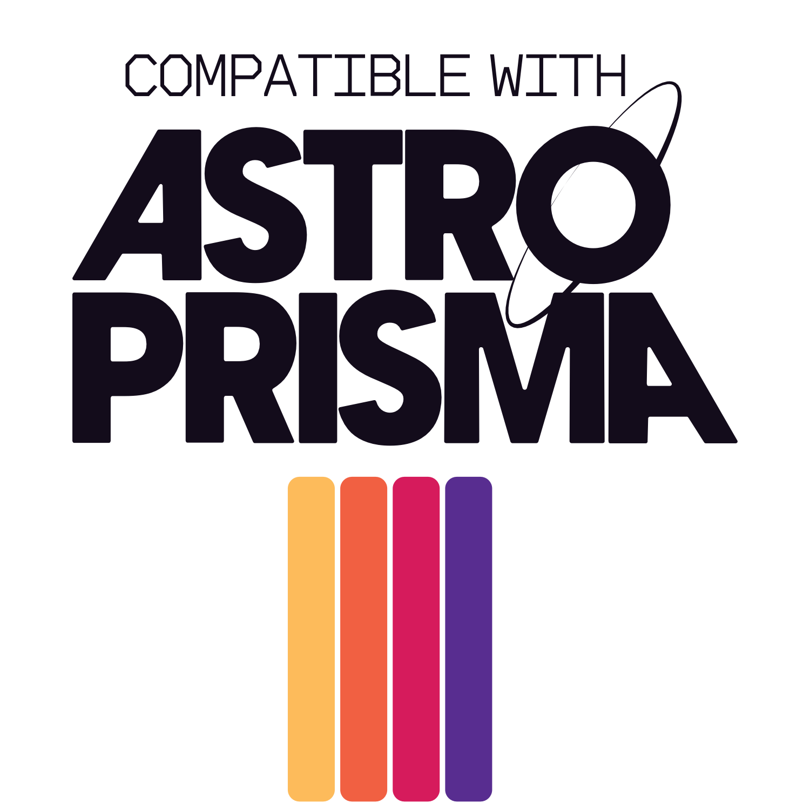

<p align="center">
  
</p>

# Astrolabe

A local-first, browser-based companion app for playing the tabletop RPG **ASTROPRISMA**, focused on solo journaling play. Every character sheet, star map, journal entry, and image lives entirely in your own browser ? there is no account, no server, and nothing leaves your machine.

## What it is

Astrolabe replaces the paper sheets and scattered notes of an Astroprisma session with a single, self-contained web page. You can track your character, your ship, the star system you are exploring, the factions you deal with, and your ongoing journal ? all side by side in a resizable multi-pane layout.

## How it works

### Local-first storage
All data is saved to your browser's **IndexedDB**. Sheets persist automatically as you type (debounced), so there is no "save" button. Because storage is per-browser, each device keeps its own separate campaigns.

### Campaigns
You can keep multiple campaigns and switch between them from the top bar. The active campaign is remembered between visits.

### The tabs
- **Character** ? vitals (health, armor, exp, energy), skills, cybertech, weapons and mods, inventory, memory slots, faction counters, and an enemy tracker.
- **Starship** ? modules, crew, connections, cargo, and a droppable ship schematic image.
- **Star System** ? the hex star map, network map, system name/type, quests, and faction strength.
- **Journal** ? freeform journaling plus dice-roll and Oracle helpers (Yes/No and open-ended prompts) for solo play.
- **Factions** ? create, name, remove, and illustrate your own factions. Faction icons and trackers on the Character and Star System sheets update to match automatically.
- **Files** ? upload images and organise them into categories. Drag any image onto a sheet field (portrait, ship schematic, star hex, faction icon) to use it.

### Panes
The layout supports **1, 2, or 4 panes**, each showing any tab, with draggable splitters so you can, for example, keep your journal open beside your character sheet.

### Images
Images are stored locally as blobs and referenced by id across your sheets. To place one, drag it from the **Files** tab onto a drop zone; right-click a drop zone to clear it.

### Export & import
Use **Export** to download a campaign as a single JSON file, and **Import** to load one back in. Exports are **text-only** ? image blobs are intentionally *not* included (only their references), keeping backups small and portable.

## Running locally

```bash
npm install
npm run dev      # start the dev server
npm run build    # type-check and build for production
npm run preview  # preview the production build
```

Built with **Svelte + Vite + TypeScript** and the `idb` wrapper around IndexedDB.

## Credits & license

Astrolabe is an independent production by Benkcsa/[ircuit and is **not** affiliated with Crescent Chimera. It is published under the **ASTROPRISMA Third Party License**.

ASTROPRISMA is copyright **Camila Mera and Crescent Chimera**.

The Astrolabe source code is released under the **MIT License** ? free to use, copy, modify, and distribute. See [LICENSE](LICENSE) for details.
